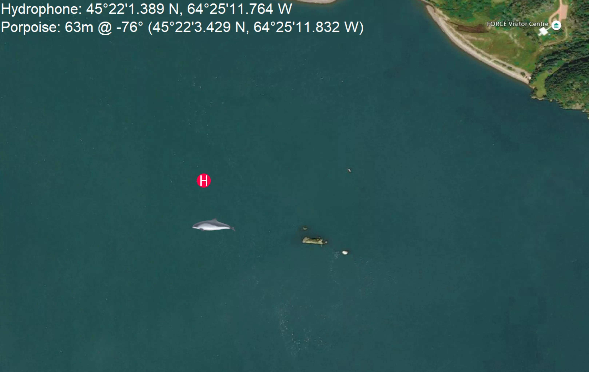

# Harbour Porpoise Map

## Example

An example screenshot of the map running is shown below:



## Installation Instructions

All of the required libraries are specified in `requirements.txt` so installing is as simple as running:

```
$ pip3 install -r requirements.txt
```

And then the map can be launched by running:
```
$ python3 map.py
```
